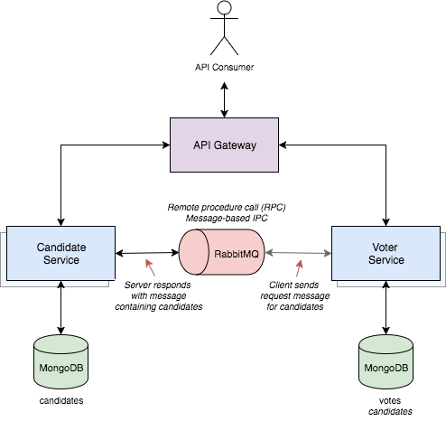

### [MSA] MSA에서 서로 다른 서비스에 존재하는 데이터가 필요할 때 어떻게 통신할까?

#### 아키텍쳐 출처

[사진 출처](https://programmaticponderings.com/2017/05/08/decoupling-microservices-using-message-based-rpc-ipc-with-spring-rabbitmq-and-ampq/)

### 사용된 AWS 서비스 종류와 간단 설명

#### AWS SQS
- EC2 인스턴스끼리의 요청을 정의하여 통신시켜주는 Message Queue 

#### AWS ApiGateway
- 클라이언트의 요청 URI 별로 Endpoint를 분기시켜주는 API Gateway

#### AWS EC2
- 각 서비스의 어플리케이션을 수행하는 EC2

### 구현 TODO
- [x] 주 비즈니스 로직 생성
- [x] 서브 비즈니스 로직 생성
- [ ] SQS 생성
- [ ] SQS Listener 생성

(TODO는 구현하면서 더 세분화 될 예정입니다.)