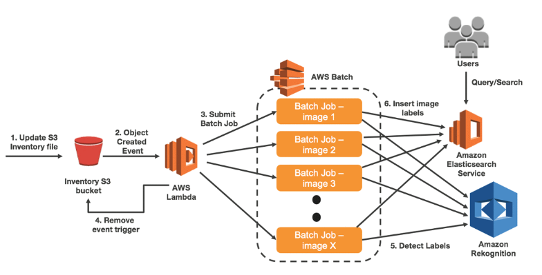

### [안드로이드] 사진을 올리면 자동 태그를 생성하고 태그를 통해 검색이 가능한 어플

#### 아키텍쳐 출처

[사진 출처](https://aws.amazon.com/ko/blogs/machine-learning/classify-a-large-number-of-images-with-amazon-rekognition-and-aws-batch/)

### 사용된 AWS 서비스 종류와 간단 설명

#### AWS S3
- 안드로이드에서 사진 올릴 저장소

#### AWS Lambda
- S3에서 AWS Batch 트리거

#### AWS Batch
- lambda에서 batch 작업 할당

#### Amazon Rekognition
- 이미지 넣어서 객체 인식하여 태그 인식

#### Amazon Elastic Serch
- 이미지 태그 저장 및 쿼리

### 구현 TODO
- [ ] 안드로이드 소스 리팩토링 - 계속 진행
- [x] 권한 설정
- [x] 안드로이드에서 S3로 이미지 전송
- [ ] Lambda 생성
- [ ] Batch 설정은 다음 주 예정
- [ ] Rekognition 추가
- [ ] Elastic Search 추가

(TODO는 구현하면서 더 세분화 될 예정입니다.)
